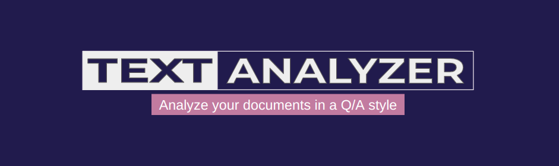
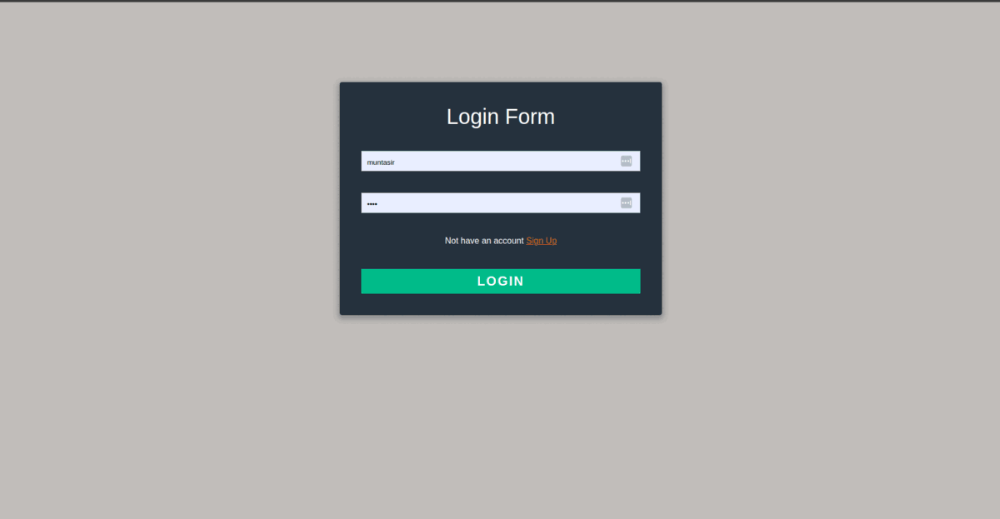

<div align="center">
    <a href="">
      
    </a>
</div>

<br/>

<!-- Table of contents -->
<div>
  <h1>Table of Contents</h1>
  <ul>
    <li><a href="#introduction">Introduction</a></li>
    <li><a href="#vector-database-overview">Vector Database Overview</a></li>
    <ul>
      <li><a href="#qdrant">Qdrant</a></li>
    </ul>
    <li><a href="#embedding-model">Embedding Model</a></li>
    <li><a href="#installation">Installation</a></li>
    <li><a href="#note">Note</a></li>
  </ul>
</div>

# Introduction
Text Analyzer is an AI powered Django application. The purpose of building this application is to explore the concept of `Vector Database` and `Embedding` and to use the power of `LLMs` to build scalable AI systems. This application can be used to analyze large amount of documents in Q/A style. The application has the feature which user can use to upload several text files. Then these texts will be divided into smaller chunks and it will be stored in the vector database. Then, there is a query section where user can ran query on their uploaded documents. The model will retrieve similar chunks from the Vector Database.

<div align="center">
    
</div>

<br>

# Vector Database Overview

<h3>What is Vector Database?</h3>

> It is the collection of learnable embeddings which has a certain dimension. It enables us to compact unstructured data in a single dimension. The exact same kind of database operations can be performed in Vector Database. It uses several mathematical functions to find similarity between query and stored embeddings.

<ul>
  <li>Cosine Similarity.</li>
  <li>DOT Product.</li>
  <li>Euclidean Distance.</li>
</ul>

> The query is converted into embedding vector by doing a forward pass from the embedding/feature extractor model. Then distance is calculated between query vector and stored vector using above distance calculator functions.

<h3>Which vector database is used?</h3>

> There are handful of vector database available for use. Some works in local and some are cloud based database. Each one has its won advantages and disadvantages.

<ul>
  <li><a href="https://qdrant.tech/">Qdrant</a></li>
  <li><a href="https://docs.pinecone.io/docs/overview">Pinecone</a></li>
  <li><a href="https://docs.trychroma.com/">Chroma DB</a></li>
</ul>

## Qdrant
Qdrant is one of the best in my view because of its vast functionalities and integrations. Qdrant provides a wrapper function over [HuggingFace](https://huggingface.co/models) models which is very useful. Using this functions, we can choose any model for our specific use case.

# Embedding Model

Embedding model is a pre-trained model that is assigned with the task of generating embedding from data. In this application we have used a pre-trained HuggingFace transformer [sentence-transformers/all-MiniLM-L6-v2](https://huggingface.co/sentence-transformers/all-MiniLM-L6-v2). This model generates embedding of size 384.

# Installation

Clone the project repository. Go to the project root directory and create a virtual environment with python 3.11.4 and activate it using following commands.

```command
virtualenv venv
source venv/bin/activate
```

When your virtual environment is activated then go for installing dependencies. Run the following commands for installing required libraries and packages.

```command
pip install -r requirements.txt
```

Now go to the [Qdrant](https://qdrant.tech/) website and create an account if you don't have any or sign in. Then create a cluster and api-key for that cluster. You will need the `host-url` and `api-key` for accessing your vector database.

Now go back to the project directory and create a `.env` file.

```
|---dashboard
|---embedding_model
|---static
    |---css
    |---images
|---templates
    |---includes
|---text_retrieval
|---uploads
|---venv
 ---.env
 ---.gitignore
 ---db.sqlite3
 ---manage.py
 ---README.md
 ---requirements.txt
```

Put your `host-url` and `api-key` in the `.env` file like following and also add a name for your collection/database.

```python
QDRANT_API_KEY = '<your-api-key>'
QDRANT_HOST = '<your-host-url>'
TEXT_COLLECTION_NAME = '<your-collection-name>'
```

After successfully installing all the dependencies run the following command for executing the django application.

```command
python manage.py runserver
```

# Note

For using this application user must have to create an account. The file upload section only allows text files. When user logged in the application creates a collection and deletes it when user logged out. Once user logged out the collection will not be found in the cloud.